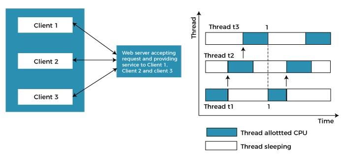
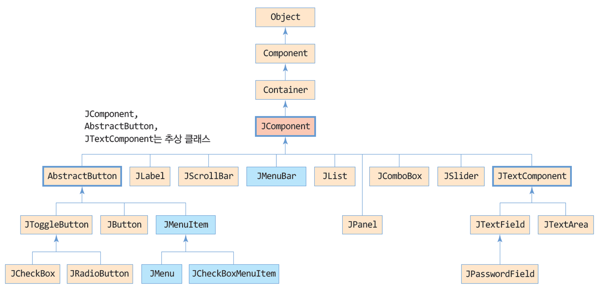

# 이동민 202030225

## 6월 7일 

176. 스윙의 페인팅 기본
        - 모든 컴포넌트는 자신의 모양을 스스로 그린다
        - 컨테이너는 자신을 그리고 그 위에 자식 컴포넌트들에게 그리도록 지시
        - 모든 스윙 컴포넌트는 자신의 모양을 그리는 paintComponent() 메소드 보유

177. public void paintComponent(Graphics g)
        - 스윙 컴포넌트가 자신의 모양을 그리는 메소드

178. paintComponent(Graphic g)의 오버라이딩
        - 개발자가 JComponent를 상속받아 새로운 컴포넌트 설계
``` java
import javax.swing.*;
import java.awt.*;

public class paintJPanelEx extends JFrame {
	public paintJPanelEx() {
		setTitle("JPanel의 paintComponent() 예제");
		setDefaultCloseOperation(JFrame.EXIT_ON_CLOSE);
		setContentPane(new MyPanel()); 
		setSize(250,200);
		setVisible(true);
	}

	class MyPanel extends JPanel {
		public void paintComponent(Graphics g) {
			super.paintComponent(g); 
			g.setColor(Color.BLUE); 
			g.drawRect(10,10,50,50); 
			g.drawRect(50,50,50,50); 

			g.setColor(Color.MAGENTA); 
			g.drawRect(90,90,50,50);
		}
	}
	public static void main(String [] args) {
		new paintJPanelEx();
	}
}
```
179. 그래픽 기반 GUI 프로그래밍
        - 스윙 컴포넌트에 의존하지 않고 선, 원 이미지 등을 이용하여 직접 화면을 구성하는 방법

180. Graphics의 기능
        - 색상 선택하기
        - 문자열 그리기
        - 도형 그리기
        - 도형 칠하기
        - 이미지 그리기
        - 클리핑

```java
import javax.swing.*;
import java.awt.*;

public class GraphicsColorFontEx extends JFrame {
	public GraphicsColorFontEx() {
		setTitle("문자열, Color, Font 사용 예제");
		setDefaultCloseOperation(JFrame.EXIT_ON_CLOSE);
		setContentPane(new MyPanel());
		setSize(300, 300);
		setVisible(true);
	}

	class MyPanel extends JPanel {
		public void paintComponent(Graphics g) {
			super.paintComponent(g);
			g.setColor(Color.BLUE); 
			g.drawString("자바가 정말 재밌다", 30,30);
			g.setColor(new Color(255, 0, 0)); 
			g.setFont(new Font("Arial", Font.ITALIC, 30));
			g.drawString("How much?", 30, 70);
			g.setColor(new Color(0x00ff00ff));
			for(int i=1; i<=4; i++) {
				g.setFont(new Font("Jokerman", Font.ITALIC, i*10));
				g.drawString("This much!!", 30, 60+i*40);
			}
		}
	}
	public static void main(String [] args) {
		new GraphicsColorFontEx();
	}
}
```
181. 도형 그리기
        - 선, 티원, 사격형, 둥근 모서리 사각형, 원호, 폐 다각형 그리기
        - 선의 굵기는 조절할 수 없음
```java
import javax.swing.*;
import java.awt.*;

public class GraphicsDrawLineEx extends JFrame {
	public GraphicsDrawLineEx() {
		setTitle("drawLine 사용");
		setDefaultCloseOperation(JFrame.EXIT_ON_CLOSE);
		setContentPane(new MyPanel());
		setSize(200, 150);
		setVisible(true);
	}

	class MyPanel extends JPanel {
		public void paintComponent(Graphics g) {
			super.paintComponent(g);
			g.setColor(Color.RED); 
			g.drawLine(20, 20, 100, 100);
            g.drawOval(20,20,80,80);
            g.drawRect(20,20,80,80);
            g.drawRoundRect(20,20,120,80,40,60);
			g.drawArc(20,100,80,80,90,270);
            // 다각형
			int []x = {80,40,80,120};
			int []y = {40,120,200,120}; 
			g.drawPolygon(x, y, 4);
		}
	}
	public static void main(String [] args) {
		new GraphicsDrawLineEx();
	}
}
```
182. JLabel을 이용한 이미지 그리기
        - 장점: 이미지 그리기 간편 용이
        - 단점: 이미지의 원본 크기대로 그리므로 이미지 크기 조절 불가
183. Graphics의 drawImage()로 이미지 출력
        - 장점: 이미지 일부분 등 이미지의 원본 크기와 다르게 그리기 가능
        - 단점: 컴포넌트로 관리할 수 없음
```java
import javax.swing.*;
import java.awt.*;

public class GraphicsDrawImageEx1 extends JFrame {
	public GraphicsDrawImageEx1() {
		setTitle("원본 크기로 원하는 위치에 이미지 그리기");
		setDefaultCloseOperation(JFrame.EXIT_ON_CLOSE);
		setContentPane(new MyPanel());
		
		setSize(300, 400);
		setVisible(true);
	}

	class MyPanel extends JPanel {
		private ImageIcon icon = new ImageIcon("images/image0.jpg");
		private Image img = icon.getImage();

		public void paintComponent(Graphics g) {
			super.paintComponent(g);
			// g.drawImage(img, 20,20, this);
            g.drawImage(img, 0, 0, getWidth(), getHeight(), this);
		}
	}

	public static void main(String [] args) {
		new GraphicsDrawImageEx1();
	}
} 
```
184. repaint()
        - 모든 컴포넌트가 가지고 있는 메소드

185. repaint()의 호출이 필요한 경우
        - 프로그램에서 컴포넌트의 모양과 위치를 변경하고 바로 화면에 반영시키고자 하는 경우
        - 컴포넌트가 다시 그려져야 그 때 변경된 위치에 변경된 모양으로 출력됨
        - repaint()는 자바 플랫폼에게 지금 당장 컴포넌트를 다시 그리도록 지시함

186. 멀티태스킹
        - 여러 개의 작업(태스크)이 동시에 처리되는 것


187. 스레드(thread)
        - 운영체제에 의해 관리되는 하나의 작업 혹은 태스크
        - 스레드와 태스크(혹은 작업)은 바꾸어 사용해도 무관

188. 멀티스레딩(multi-threading)
        - 여러 스레드를 동시에 실행시키는 응용프로그램을 작성하는 기법

189. 스레드 코드
        - 작업을 실행하기 위해 작성한 프로그램 코드
        - 개발자가 작성
190. 스레드 정보
        - 스레드 명, 스레드 ID, 스레드의 실행 소요 시간, 스레드의 우선 순위 등 
        - 운영체제가 스레드에 대해 관리하는 정보

191. 멀티프로세싱
        - 하나의 응용프로그램이 여러 개의 프로세스를 생성하고, 각 프로세스가 하나의 작업을 처리하는 기법
        - 각 프로세스 독립된 메모리 영역을 보유하고 실행
        - 프로세스 사이의 문맥 교환에 따른 과도한 오버헤드와 시간 소모의 문제점

192. 멀티스레딩
        - 하나의 응용프로그램이 여러 개의 스레드를 생성하고, 각 스레드가 하나의 작업을 처리하는 기법
        - 하나의 응용프로그램에 속한 스레드는 변수 메모리, 파일 오픈 테이블 등 자원으로 공유하므로, 문맥 교환에 따른 오버헤드가 매주 작음
        - 현재 대부분의 운영체제가 멀티스레딩을 기본으로 하고 있음
    


193. 자바 스레드
        - 자바 가상 기계(JVM)에 의해 스케쥴되는 실행 단위의 코드 블럭
        - 스레드의 생명 주기는 JVM에 의해 관리됨 : JVM은 스레드 단위로 스케쥴링

194. JVM과 자바의 멀티스레딩
        - 자바 응용프로그램이 시작될 때 JVM이 함께 실행됨
        - 자바 응용프로그램이 종료하면 JVM도 함께 종료함

195. 스레드 만드는 2가지 방법
        - java.lang.Thread 클래스를 상속받아 스레드 작성
        - java.lang.Runnable 인터페이스를 구현하여 스레드 작성
```java
import java.awt.*;
import javax.swing.*;

class TimerThread extends Thread {
	private JLabel timerLabel; 
	public TimerThread(JLabel timerLabel) {
		this.timerLabel = timerLabel; 
	}

	
	@Override
	public void run() {
		int n=0; 
		while(true) { 
			timerLabel.setText(Integer.toString(n)); 
			n++; 
			try {
				Thread.sleep(1000); 
			}
			catch(InterruptedException e) {	return;}
		}	
	}
}
public class ThreadTimerEx extends JFrame {
	public ThreadTimerEx() {
			setTitle("Thread를 상속받은 타이머 스레드 예제");
			setDefaultCloseOperation(JFrame.EXIT_ON_CLOSE);
			Container c = getContentPane();
			c.setLayout(new FlowLayout());
			setSize(250, 150);
			setVisible(true);

			JLabel timerLabel = new JLabel();
			timerLabel.setFont(new Font("Gothic", Font.ITALIC, 80));
			c.add(timerLabel);
	
			TimerThread th = new TimerThread(timerLabel);
			th.start(); 
	}
	public static void main(String[] args) {
		new ThreadTimerEx();
	}
}
```
```java
import java.awt.*;
import javax.swing.*;

class TimerThread extends Thread {
	private JLabel timerLabel; 
	public TimerThread(JLabel timerLabel) {
		this.timerLabel = timerLabel; 
	}

	
	@Override
	public void run() {
		int n=0; 
		while(true) { 
			timerLabel.setText(Integer.toString(n)); 
			n++; 
			try {
				Thread.sleep(1000); 
			}
			catch(InterruptedException e) {	return;}
		}	
	}
}
public class ThreadTimerEx extends JFrame {
	public ThreadTimerEx() {
			setTitle("Thread를 상속받은 타이머 스레드 예제");
			setDefaultCloseOperation(JFrame.EXIT_ON_CLOSE);
			Container c = getContentPane();
			c.setLayout(new FlowLayout());
			setSize(250, 150);
			setVisible(true);

			JLabel timerLabel = new JLabel();
			timerLabel.setFont(new Font("Gothic", Font.ITALIC, 80));
			c.add(timerLabel);
	
			TimerThread th = new TimerThread(timerLabel);
			th.start(); 
	}
	public static void main(String[] args) {
		new ThreadTimerEx();
	}
}
```
196. main 스레드
        - JVM이 응용프로그램을 실행할 떄 디폴트로 생성되는 스레드

197. 
 --------------------------------------------------------------------------------
1. 프로젝트 생성시 디렉터리 판별 및 주의 

2. 생성 후 이전 시간에 하던 생성물들 복사 붙여넣기로 하고 자바 생성물 src로 옳긴 후 디버깅 

3. VSC 쓰는 이유는 깊이가 생겨서 쓰기가 편해진다

4. 언어는 2가지 (고급언어, 저급어(기계어, 어셈블리어))가 있다

5. 고급언어는 사람이 이해하기 쉽고 복잡한 작업, 알고리즘을 표현하기 위한 고안된 언어 
    - 기계어는 이진수로 구성된 언어이고 CPU는 기계어만 이해하고 처리가능 
    - 어셈블리어는 니모닉 기호로 일대일 대응시킨 언어

6. 소스는 프로그래밍언어로 작성된 텍스트 파일, 컴파일은 소스파일을 컴퓨터가 이해할 수 있는 기계어로 만드는 과정

7. 플랫폼 = 하드웨어 플랫폼 + 운영체제 플랫폼

8. 프로그램의 플랫폼 호환성 없는 이유 (기계어가 CPU마다 다름, 운영체제마다 API 다름, 체제마다 실행파일 형식이 다름)

9. WORA(write onece run anywhere) 
   - 한번 작성된 코드는 모든 플랫폼에서 바로 실행되는것이 자바 특징
   - C/C++ 등 기존 언어가 가진 플랫폼 종속성 극복
   - 네트워크에 연결된 어느 클라이언트에서나 실행

10. WORA를 가능하개 하는 자바의 특징
    - 바이트코드 (자바 컴파일러로가 자바 소스프로그램을 컴파일한 일종의 기계어)
    - JVM (자바가상기계)

11. 실현 환경: 자바 가상 기계 + 자바 API 라이브러리

12. 응용프로그램 실행
    - main()메소드를 가진 클래스는 main()에서 시작

13. JDK와 JRE (JDK안에는 JRE 포함)

14. JAVA SE의 JDK 구조 확인

15. 사용자 디렉터리 구조 확인

16. 모듈 프로그래밍
    - 자바 응용프로그램을 마치 직소 퍼즐을 연결하듯 필요한 모듈을 연결하는 방식으로 구성

17. 모듈이란 
    - 자바 패키지들과 이미지, XML 파일등의 자원들을 묶은 단위

18. 모듈화
    - JAVA9에서 정의된 새로운 기능

19. 자바 API 
    - JDK에 포함된 클래스 라이브러리 
    - 개발자는 API를 쉽고 빠르게 자바 프로그램 개발

20. 자바 패키지
    - 계층구조로 되어 있음
    - 자바 API는 JDK에 패키지 형로 제공 자진의 패키지 생성 가능

21. 서블릿 
    - 웹서버에서 실행되는 자바 프로그램
    - 서블릿은 사용자 인터페이스를 필요로 하지 않으며 웹 서버에 의해 실행이 제어된다

22. 자바의 특성
    - 플랫폼 독립성 (종속되지 않는 바이트 코드로 플랫폼 독립성)
    - 객체지향 (캡슐화, 다형성 지원)
    - 클래스로 캡슐화 
    (자바의 모든 변수나 메소드는 클래스내에 선언 / 
    클래스 안에서 클래스 (멤버 함수) 작성 가능)
    - 소스와 클래스 파일 (하나의 여러소스에 여러개의 클래스를 작성한 경우 별도의 클래스 파일 생성)

23. 자바 특성2
    - 실행 코드 베포
    - 패키지 
    - 멀티스레드
    - 가비지 컬렉션

24. 자바 특성3
    - 실시간 응용프로그램에 부적합
    - 자바 프로그램은 안전
    - 프로그램 작성 쉬움
    - 실행 속도 개선을 위한 JIT 컴파일러 사용

25. 자바 프로그램의 구조
    - 클래스 만들기
    - 주석문
    - main() 메소드
    - 메소드
    - 변수 선언 
    - 문장
    - 출력

26. 식별자
    - 클래스, 변수, 상수, 메소드 등에 붙이는 이름

27. 대소문자 구별
    - int BarChart;와 int barChart;는 서로 다른 식별자 선언

28. 자바 데이터 타입
    - booleam, char, byte, short, int, long, float, double

29. 래퍼런스 타입
    - 배열에 대한 래퍼런스
    - 클래스에 대한 래퍼런스
    - 인터페이스에 대한 래퍼런스

30. 문자열
    - String 클래스로 문자열 표현
    - 문자열괴 기본타입의 + 연산으로 문자열을 연결한 새로운 문자열 생성

31. 변수
    - 프로그램에 실행중에 값을 임시 저장하는 공간

32. 리터럴
    - 프로그램에서 직접 표현한 값
    - 정수, 실수, 문자, 논리, 문자열, 리터럴이 있음

33. 정수 리터럴
    - 정수 리터럴은 int형으로 컴파일

34. 변수
    - 프로그램 실행 중 값을 임시 저장하기 위한 공간

35. 선언
    - 변수의 타입 크기에 맞게 메모리 할당

36. 실수 리터럴
    - 소수점 형태나 지수 형태로 표편한 실수
    - 실수 타입 리터럴은 더블 타입으로 컨트롤
    - 단일 부호로 표현
    - 특수문저 리터럴은 백슬레시로 시작

37. 논리값 표기

38. null 리터럴
    - 래퍼런스 대입에 사용

39. 문자열 리터럴
    - 이중 인용부호로 묶어 표현
    - 문자열 리터럴(String)은 스트링객체로 자동처리

40. 상수 선언
    - final 키워드 사용
    - 선언시 초깃값 사용
    - 실행 중 변경 불가

41. var 키워드
    - 자바10부터 도입
    - 기존의 변수 선언 방식 : 변수의 타입 반드시 지정
    - 타입 생략하고 변수 선언 가능
    - 컴파일러가 추론하고 변수 타입 결정
    - 지역 변수 선언에만 한정
    - 초깃값이 주어지지 않으면 오류

42. 타입 변환
    - 한 타입의 값을 다른 타입의 값으로 변환

43. 자동 타입 변환
    - 컴파일러에 의해 원래의 타입보다 큰 타입으로 자동 변환

44. 강제 타입 변환
    - 개발자의 의도적 타입 변환
    - ()안에 개발자가 명시적으로 타입 변환 지정
    - 강제 변환은 값 손실 우려

45. System.in
    - 키보드와 연결된 자바의 표준 입력 스트림

46. Scanner 클래스
    - 읽은 바이트를 문자, 정수, 실수, 문자열 등 다양한 타입으로 변환하여 리턴

47. Scanner에서 키 입력 받기
    - Scanner에서 입력되는 키 값을 공백으로 구분되는 토큰 단위로 읽는다

48. 연산
    - 주어진 식을 계산하여 결과를 얻어내는 과정

49. 산술 연산자
    - 더하기 빼기 곱하기 나누기 나머지와 응용

50. 증감 연산

51. 대입 연산
    - 연산의 오른쪽 결과는 왼쪽 변수에 대입

52. 비교 연산, 논리 연산

53. 조건 연산
    - 3개의 피연산자로 구성된 삼향(ternary) 연산자

54. 비트 연산 
    - 비트 논리 연산 (비트끼리 AND, OR, XOR, NOT 연산)

55. 조건문 
    - 단순 if 문 
    - if-else 문

56. 다중 if문
    - 조건이 너무 많은 경우 switch 문 사용 권장

57. 중첩 if-else
    - if문이나 else문 혹은 if-else 문에 if나 if-else문을 내포할 수 있다

58. swith문 
    - switch문은 식과 case 문의 값과 비교
    - case의 비교 값과 일치하면 해당 case의 실행 문장 수행

59. break문
    -  break문을 만나면 switch문 벗어남

60. case 문의 값
    - 실수 리터럴은 허용되지 않움
    - 문장, 정수, 문자열 리터럴만 허용 (JDK 1.7부터)

61. 자바 반복문
    - for 문 - 가장 많이 사용하는 반복문
    - while 문 - while문의 조건식은 for문과 동일 조건식이 참인 경우 반복 실행
    - do while 문 - 작업문은 한 번 반드시 실행

62. 중첩 반복
    -  반복문이 다른 반복문을 내포하는 구조

63. 배열
    - 인덱스와 인덱스에 대응하는 데이터들로 이루어진 자료 구조
    - 배열은 같은 타입의 데이터들을 순차적으로 저장되는 공간

64. 배열 선언과 배열 생성의 두 단계 필요
    - 배열 선언 - 이름 선언
    - 배열 생성 - 공간 할당 받는 과정
    - 배열 초기화 - 생성과 값 초기화

65. 배열 인덱스
    - 배열의 인덱스는 0 ~ (배열 크기 -1)

66. length 필드
    - 배열의 크기는 배열 객체의 length 필드에 저장

67. for-each 문
    - 배열이나 나열의 원소를 순차 접근하는데 유용한 for 문

68. 2차원 배열 선언
    - int intArray[][]; 또는 int[][] int Array; (단 잘 안씀)

69. 배열 리턴
    - 배열의 래퍼런스만 리턴 (배열 전체가 리턴되는 것이 아님)

70. 메소드의 리턴 타입
    - 리턴하는 배열 타입과 리턴 받는 배열 타입 일치
    - 리턴 타입에 배열의 크기를 지정하지 않음

71. 예외
    - 실행 중 오작동이나 결과에 악영향을 미치는 예상치 못한 상황

72. 예외 발생 경우
    - 정수를 0으로 나눈 경우
    - 배열의 크기보다 큰 인덱스로 배열의 원소를 접근하는 경우

73. 예외처리 
    - 발생한 예외에 대해 개발자가 작성한 프로그램 코드에서 대응하는 것
    - try-catch-finally문 사용

74. 실세계 객체의 특징 
    - 객체마다 고유한 특성와 행동을 가짐
    - 다른 객체들과 정보를 주고 받는 등, 상호작용 하면서 살아감

75. 객체의 가장 본질적 특징
    - 캡슐화 (객체를 캡슐로 싸서 내부를 볼 수 없게 하는 것)
    - 상속 (상위 개체의 속성이 하위 개체에 물려짐)
    - 다형성 (같은 이름의 메소드가 클래스 혹은 객체에 따라 다르게 구현되는 것)

76. 자바 상속
    - 상위 클래스: 슈퍼 클래스
    - 하위 클래스: 서브 클래스, 슈퍼 클래스 코드 재사용, 새로운 특성 추가 가능

77. 다형성 사례
    - 메소드 오버로딩: 한 클래스 내에서 같은 이름이지만 다르게 작동하는 여러 메소드
    - 메소드 오버라이딩: 슈퍼클래스의 메소드를 동일한 이름으로 서브클래스마다 다르게 구현

78. 객체 지향 언어
    - 상속, 다향성, 캡슐화, 객체등 소프트웨어 재사용을 위한 여러 장치 내장
    - 소프트웨어 재사용과 부분 수정 빠름
    - 소프트웨어를 다시 만드는 부담 대폭 줄임
    - 소프트웨어 생산성 향상

79. 클래스
    - 객체의 속성과 행위 선언
    - 객체의 설계도 혹은 틀
    - class 키워드로 선언
    - 멤버: 클래스 구성요소

80. 객체 
    - 클래스의 틀로 찍어낸 실체

81. 생성자
    - 객체가 생성될 때 초기화 목적으로 실행되는 메소드

82. 기본생성자
    - 매개 변수가 없고 아무 작동 없이 단순 리턴하는자

83. this
    - 객체 자신의 대한 래퍼런스

84. 자바의 객체 배열
    - 객체에 대한 래퍼런스 배열

85. 메소드
    - 메소드 C/C++의 함수와 동일
    - 자바의 모든 메소드는 반드시 클래스 안에 있어야 함

86. 접근 지정자
    - 다른 클래스에서 메소드로 접근할 수 있는지 여부 선언

87. 배열 래퍼런스만 매개 변수에 전달
    - 배열 통째로 전달하지 않은 경우

88. 객체가 전달되는 동일한 경우
    - 매개 변수가 살인자의 배열 공유

89. 오버로딩
    - 한 클래스 내에서 두 개 이상의 이름이 같은 메소드 작성
    - 메소드 이름이 동일해야 함
    - 여기서 리턴 타입은 관계 없음

90. 객체 소멸
    - new에 의해 할당 받은 객체와 배열 메모리를 자바 가상 기계로 되돌려 주는 행위
    - 소멸된 객체 공간은 가용 메모리에 포함
    - 자바에서 사용자 임의로 객체 소멸 안됨
    - 자바는 객체 소멸 연산자 없음

91. 가비지
    - 가리키는 래퍼런스가 하나도 없는 객체

92. 가비지 컬렉션
    - 컬렉터가 자동으로 가비지 수집, 반환
    - 자바 가상 기계가 가비지 자동 회수
    - 가비지 컬렉터에 의해 자동 수행

93. 강제 수행
    - System 또는 Runtime 객체의 gc() 메소드 호출

93. 패키지
    - 상호 관련 있는 클래스 파일(컴파일된 .class)을 저장하여 관리하는 디렉터리
    - 자바 응용프로그램은 하나 이상의 패키지로 구성
 
94. 접근 지정자
    - 4가지: private, protected, public, 디폴트
    - 접근 지정자의 목적

95. 클래스 접근 지정
    - 다른 클래스에서 사용하도록 허용할지 지정
    - public 멤버: 다른 모든 클래스에게 접근 허용
    - 디폴트 멤버: 같은 패키지의 클래스에만 접근 허용
    - private 멤버: 동일 클래스내에만 접근 허용
    - protected 멤버: 같은 패키지내의 다른 모든 클래스에게 접근 허용
 
96. static 멤버 
    - 클래스당 하나만 생성  
    - 객체들에 의해 공유됨
    - 클래스 로딩시에 멤버 생성
    - 전역 변수와 전역 멤버 만들때 활용

96. non-static 멤버
    - 멤버는 객체마다 별도 존재
    - 객체 생성 시에 멤버 생성됨
    - 공유되지 않음

97. static 메소드 제약조건
    - static 메소드는 오직 static 멤버만 접근 가능
    - 객체가 생성되지 않은 상황에서도 static 메소드는 실행될 수 있기 때문에 non-static 멤버 활용 불가
    - non-static 메소드는 static 멤버 사용 가능
    - static 매소드는 객체없이 사용 가능하므로 this 래퍼런스 사용할 수 없음

98. final 클래스
    - 더 이상 상속 불가능

99. fianl 메소드
    - 더 이상 오버라이딩 불가능

100. final 필드, 상수 선언
        - 상수를 선언할 때 사용
        - 상수 필드는 선언 시에 초기 값을 지정하여야 한다
        - 상수 필드는 실행 중에 값을 변경할 수 없다

101. 상속 선언
        - extends 키워드로 선언

102. 서브 클래스 객체 모양
        - 슈퍼 클래스 객체와 서브 클래스 객체는 별개
        - 서브 클래스 객체는 슈퍼 클래스 객체 포함

103. 자바 상속의 특징
        - 클래스 다중 상속 불허
        - 모든 자바 클래스는 묵시적으로 Object클래스 상속 받음

104. protected 멤버에 대한 접근
        - 같은 패키지의 모든 클래스에게 허용
        - 상속되는 서브 클래스에게 허용

105. 슈퍼 클래스와 서브 클래스
        - 각각 여러개의 생성자 생성 가능

106. 서브 클래스의 객체가 생성될 때
        - 슈퍼 클래스 생성자 1개와 서브 클래스 1개가 실행

107. 서브 클래스의 생성자와 슈퍼 클래스의 생성자가 결정되는 방식
        - 개발자의 명시적 선택
        - 컴파일러가 기본생성자 선택

108. 업캐스팅
        - 서브 클래스의 레퍼런스를 슈퍼 클래스 레퍼런스에 대입
        - 슈퍼 클래스 레퍼런스로 서브 클래스 객체를 가리키게 되는 현상

109. 다운캐스팅
        - 슈퍼 클래스 레퍼런스를 서브 클래스 레퍼런스에 대입
        - 업캐스팅된 것을 다시 되돌리는 것
        - 반드시 명시적 타입 변환 지정

110. instanceof 연산자
        - 레퍼런스가 가리키는 객체의 타입 식별

110. 메소드 오버라이딩
        - 서브 클래스에서 슈퍼 클래스의 메소드 중복 작성
        - 슈퍼 클래스의 메소드 무력화 항상 서브 클래스 오버라이딩한 메소드가 실행되도록 보장됨

111. 조건
     - 슈퍼 클래스의 원형 조건 동일 해야함

112. 오버라이딩으로 다형성 실현
     - 하나의 인터페이스에 서로 다른 구현

113. 추상 메소드
        - abstract로 선언된 메소드, 메소드의 코드는 없고 원형만 선언

114. 추상 클래스
        - 추상 메소드를 가지며 abstract로 선언된 클래스
        - 추상 메소드 없이, abstract로 선언한 클래스
        - 인스턴스 생성 불가

115. 추상 클래스 상속
        - 추상 클래스 상속 받으면 추상 클래스가 됨
        - 서브 클래스도 abstract로 선언해야 함

116. 구현
        - 서브 클래스에서 슈퍼 클래스의 추상 메소드 구현(오버라이딩)
        - 추상 클래스를 구현한 서브 클래스는 추상 클래스 아님

117. 추상 클래스의 목적
        - 상속을 위한 슈퍼 클래스로 활용하는 것
        - 서브 클래스에서 추상 메소드 구현
        - 다형성 실현

118. 자바의 인터페이스
        - 클래스가 구현해야 될 메소드들이 선언되는 추상형

119. 인터페이스 선언
     - interface 키워드로 선언

120. 인터페이스 간의 상속 가능
     - 인터페이스를 상속하여 확장된 인터페이스 작성 가능

121. 패키지
        - 서로 관련된 클래스와 인터페이스를 컴파일한 파일들 묶어놓은 디렉터리
        - 하나의 응용프로그램은 한 개 이상의 패키지로 작성
        - 패키지는 jar 파일로 압축할 수 있음

122. 모듈
        - 여러 패키지와 이미지 등의 자원을 모아 놓은 컨테이너
        - 하나의 모듈을 하나의 .jmod 파일에 저장

123. 모듈화 목적
        - 컴포넌트들을 필요에 따라 조립하여 사용하기 위함
        - 컴퓨터 시스템의 불필요한 부담 감소

124. Object 클래스
      - 모든 자바 클래스는 반드시 Object 상속 받도록 컴파일

125. Wrapper 클래스
        - 자바의 기본 타입을 클래스화한 8개 클래스를 특징
        - 객체만 사용할 수 있는 컬렉션 등에 기본 타입의 값을 사용하기 위해 Wrapper 객체로 만들어 사용

126. 박싱
     - 기본 타입의 값을 Wrapper 객체로 변환하는 것

127. 언박싱
     - Wrapper 객체에 들어 있는 기본 타입과 값을 빼내는 것

128. 스트링 리터럴
     - 자바 가상 기계 내부에서 리터럴 테이블에 저장되고 관리됨
     - 응용프로그램에서 공유됨

129. 컬렉션의 개념
        - 요소라고 불리는 가변 개수의 객체들의 저장소
        - 고정 크기의 베열을 다루는 어려움 해소
        - 다양한 객체들의 삽입, 삭제, 검색 등의 관리 용이

130. 제네릭 기법
        - 특정 타입만 다루지 않고 여러 종류의 타입으로 변신할 수 있도록 클래스나 메소드를 일반화 시키는 기법
        - 클래스나 인터페이스 이름에 <E>, <K>, <V>등 타입매개변수 포함
        - 사례: 벡터 Vector<E>
        - C++ 템플릿(template)과 동일

131. 벡터 Vector<E> 특성
        - <E>에 사용할 요소의 특정 타입으로 구체화
        - 배열에 가변 크기로 다룰 수 있게 하는 컨테이너
        - 요소 객체들을 삽입, 삭제, 검색하는 컨테이너
        - Vector에 삽입 가능한 것
        - Vector에 객체 삽입
        - Vector에서 객체 삭제

132. ArrayList<E>
        - 가변 크기 배열을 구현한 클래스
        - 벡터와 거의 동일

133. Iterator<E> 인터페이스
        - 리스트 구조의 컬렉션에서 요소의 순차 검색을 위한 인터페이스

134. HashMap<K,V>
        - 키(key)와 값(value)의 쌍으로 구성되는 요소를 다루는 컬렉션
        - 삽입 및 검색이 빠른 특징

135. Swing 패키지
        - AWT 기술을 기반으로 작성된 자바 라이브러리
        - 모든 AWT 기능 + 추가된 풍부하고 화려한 고급 컴포넌트
        - 순수 자바 언어로 구현 및 자바의 GUI로 사용됨
        - AWT 컴포넌트를 모두 스윙으로 재작성 AWT 이름 앞에 J자 덧붙임

136. 컨테이너
        - 다른 컴포넌트를 포함할 수 있는 GUI 컴포넌트
        - 다른 컨테이너에 포함 될 수 있음

137. 컴포넌트
        - 컨테이너에 포함되어야 화면에 출력될 수 있는 GUI 객체
        - 다른 컴포넌트를 포함할 수 없는 순수 컴포넌트

138. 스윙 GUI 프로그램 만드는 과정
        - 스윙 프레임 만들기
        - Main() 메소드 작성
        - 스윙 프레임에 스윙 컴포넌트 붙이기

139. 스윙 프레임
        - 모든 스윙 컴포넌트를 담는 최위 컨테이너
        - JFrame을 상속받아 구현
        - 프레임 크기 반드시 지정: setSize() 호출
        - 프레임을 화면에 출력하는 코드 반드시 필요: setVisible(true) 호출

140. 프레임에 컴포넌트 붙이기
        - 타이틀 달기 (super()나 setTitle() 이용)
        - 컨텐트팬에 컴포넌트 달기 (컨텐트팬은 스윙 컴포넌트들이 부착되는 공간)

141. 컨테이너의 배치관리자
        - 컨테이너마다 하나의 배치관리자 존재
        - 컨테이너에 부착되는 컴포넌트 위치와 크기 설정

142. 배치관리자 유형 4가지
        - FolwLayout: 컴포넌트가 삽입되는 순서대로 왼쪽에서 오른쪽으로 배치
        - BorderLayout: 공간을 동, 서, 남, 북, 중앙 5개 영역 나눔
        - GridLayout: 프로그램에서 설정한 동일한 크기의 2차원 격자로 나눔
        - CardLayout: 컨테이너 공간에 카드를 쌓아 놓은듯 포개어 배치

143. 새로운 배치관리자 설정
        

144. 배치방법
        - 컴포넌트를 컨테이너 내에 왼쪽에서 오른쪽으로 배치 (다시 위에서 아래로 순서대로 배치)

145. FolwLayout(int align, int hGap, int vGap)
        - align: 정렬하는 방법 지정
        - hGap: 좌우 두 사이 수평 간격 (디폴드 5)
        - vGap : 상하 두 컴퍼넌트 사이의 수직 간격 (디폴트 5)
     
``` java (FlowLayout)
import javax.swing.*;
import java.awt.*;

public class FlowLayoutEx extends JFrame{
    public FlowLayoutEx() {
        setTitle("FlowLayout 에제");
        setDefaultCloseOperation(JFrame.EXIT_ON_CLOSE);
        Container contentPanne = getContentPane();

        contentPanne.setLayout(new FlowLayout(FlowLayout.LEFT, 30, 40));
    
        contentPanne.add(new JButton("add"));
        contentPanne.add(new JButton("sub"));
        contentPanne.add(new JButton("mul"));
        contentPanne.add(new JButton("div"));
        contentPanne.add(new JButton("Calculate"));

        setSize(300, 200);
        setVisible(true);
    }

    public static void main(String[] args) {
        new FlowLayoutEx();
    }
} 
```
146. BorderLayout 배치관리자
        - 컨테이너 공간을 동 서 남 북 중앙 분활, 배치
        - hGap: 좌우 두 사이 수평 간격 (디폴드 0)
        - vGap : 상하 두 컴퍼넌트 사이의 수직 간격 (디폴트 0)
``` java
import javax.swing.*;
import java.awt.*;

public class BorderLayoutEx extends JFrame{
    public BorderLayoutEx() {
        setTitle("BorderLayout 에제");
        setDefaultCloseOperation(JFrame.EXIT_ON_CLOSE);
        Container contentPanne = getContentPane();

        contentPanne.setLayout(new BorderLayout ());
    
        contentPanne.add(new JButton("CENTER"), BorderLayout.CENTER);
        contentPanne.add(new JButton("NORTH"), BorderLayout.NORTH );
        contentPanne.add(new JButton("SOUTH"), BorderLayout.SOUTH);
        contentPanne.add(new JButton("EAST"), BorderLayout.EAST);
        contentPanne.add(new JButton("WEST"), BorderLayout.WEST);

        setSize(300, 200);
        setVisible(true);
    }

    public static void main(String[] args) {
        new BorderLayoutEx();
    }
} 
```

147. GridLayout
     -  동일한 사각형 격자로 분활하고 각 셀에 컴포넌트 하나씩 배치

```java
import javax.swing.*;
import java.awt.*;

public class GridLayoutEx extends JFrame {
    public GridLayoutEx() {
        super("BorderLayout 예제");                       
        setDefaultCloseOperation(JFrame.EXIT_ON_CLOSE);
        Container contentPane = getContentPane();              
         
        //1x10의 GridLayout 배치관리자
        contentPane.setLayout(new GridLayout(4, 3));             

        for(int i=9; i>0; i--) {                                
            String text = Integer.toString(i);                  변환               
            contentPane.add(new JButton(text));                  
        }       

        contentPane.add(new JButton("*"));
        contentPane.add(new JButton("0"));

        setSize(300, 200);                       
        setVisible(true);                                   
    }

    public static void main(String[] args) {
        new GridLayoutEx();
    }
}
```
148. 배치관리자가 없는 컨테이너가 필요한 경우
        - 응용프로그램에서 직접 컴포넌트의 크기와 위치를 결정고자 하는 경우

149. 배치관리자가 없는 컨테이너에 컴포넌트를 삽입 할 떄
        - 프로그램에서 컴포넌트의 절대 크기와 위치 설정
        - 서로 겹치게 할 수 있음

150. 이벤트 기반 프로그래밍
        - 이벤트의 발생에 의해 프로그램흐름이 결정되는 방식
        - 반대되는 개념: 배치 실행

151. 처리되는 과정
        - 이벤트 발생
        - 이벤트 객체 생성
        - 응응프로그램에 작성된 이벤트 리스너 찾기
        - 이벤트 리스너 실행
 
 152. 이벤트 객체
        - 발생한 이벤트에 관한 정보를 가진 객체
        - 이벤트 리스너에 의해 전달됨
 
 153. 포함하는 정보
        - 이벤트 종류와 이벤트 소스
        - 이벤트가 발생한 화면 좌표 및 컴포넌트 내 좌표
        - 발생된 버튼이나 메뉴 아이템의 문자열
        - 클릭된 마우스 버튼 및 클릭 횟수
        - 키의 코드 값과 문자 값
 
 154. 이벤트 리스너
        - 이벤트를 처리하는 자바 프로그램 코드, 클래스로 작성
        - 자바의 리스너 인터페이스를 상속받아 구현
        - 리스너 인터페이스의 모든 추상 메소드 구현
 
 155. 이벤트와 이벤트 리스너 선택
        - 버튼 클릭을 처리하고자 하는 경우: 액션 이벤트, 이벤트 리스너, 액션 리스너

156. 이벤트 리스너 등록
        - 이벤트를 받아 처리하고자 하는 컴포넌트에 이벤트 리스너 등록

157. 이벤트 리스너 3가지 작성 방법
        - 독립 클래스 작성 (이벤트 리스를 완전히 클래스로 작성)
        - 내부 클래스로 작성 (클래스 안에 맴버처럼 클래스 작성)
        - 익명 클래스로 작성 (클래스의 이름 없이 간단히 리스너 작성)

```java
import java.awt.*;
import java.awt.event.*;
import javax.swing.*;

public class IndepClassListener extends JFrame {
    public IndepClassListener() {
        setTitle("Action 이벤트 리스너 예제");
        setDefaultCloseOperation(JFrame.EXIT_ON_CLOSE);
        Container c = getContentPane();
        c.setLayout(new FlowLayout());
        JButton btn = new JButton("Action");
        btn.addActionListener(new MyActionListener());
        c.add(btn);
        setSize(250, 120);
        setVisible(true);
    }

    public static void main(String[] args) {
        new IndepClassListener();
    }
}

class MyActionListener implements ActionListener {
    public void actionPerformed(ActionEvent e) {
        JButton b = (JButton)e.getSource();
        if(b.getText().equals("Action"))
            b.setText("액션");
        else 
            b.setText("Action");
    }
}
```
156. 익명 클래스로 이벤트 리스너 작성
        - 익명 클래스: 이름 없는 클래스 ((클래스선언 + 인스턴스 생성)을 한번에 달성)
        - 간단한 리스너의 경우 익명 클래스 추천
```java
import java.awt.*;
import java.awt.event.*;
import javax.swing.*;

public class AnonymousClassListener extends JFrame {
    public AnonymousClassListener() {
        setTitle("Action 이벤트 리스너 예제");
        setDefaultCloseOperation(JFrame.EXIT_ON_CLOSE);
        Container c = getContentPane();
        c.setLayout(new FlowLayout());
        JButton btn = new JButton("Action");
        
        // 익명 클래스 리스너 추가
        btn.addActionListener(new ActionListener() {
            public void actionPerformed(ActionEvent e) {
                JButton b = (JButton)e.getSource();
                if (b.getText().equals("Action"))
                    b.setText("액션");
                else
                    b.setText("Action");
                setTitle(b.getText());
            }
        });
        
        c.add(btn);
        setSize(250, 120);
        setVisible(true);
    }

    public static void main(String[] args) {
        new AnonymousClassListener();
    }
}
```
157. Key 이벤트와 포커스
        - 키 입력시 각각 Key 이벤트 발생 (키를 누르는 순간/키를 떼는 순간)
        - 키 이벤트를 받을 수 있는 조건(모든 컴포넌트, 현재 포커스를 가진 컴포넌트가 키 이벤트 독점)
        - 포커스 (컴포넌트나 응용프로그램이 키 이벤트를 독점하는 권한)

158. 키 리스너
        - 응용프로그램에서 키 리스너를 상속받아 키 리스너 구현
    
159. 키 이벤트 객체
        - 입력된 키 정보를 가진 이벤트 객체
        - 키 이벤트 객체의 메소드로 입력된 키 판별

160. 가상 키
        - 가상 키는 키 이벤트 클래스에 상수로 선언

161. 마우스 이벤트
        - 사용자의 마우스 조작에 따라 발생하는 이벤트

162. 자바의 GUI 프로그래밍 방법 종류
        - 컴포넌트 기반 GUI 프로그래밍
        - 그래픽 기반 GUI 프로그래밍



163. 스윙 컴포넌트의 공통 메소드 JComponent의 메소드
        - 스윙컴포넌트는 모두 상속받는 슈퍼, 추상 클래스
        - 스윙 컴포넌트들이 상속받는 공통메소드와 상수 구현
```Java 
import java.awt.*;
import java.awt.event.*;
import javax.swing.*;

public class JComponentEx extends JFrame {
    public JComponentEx() {
        super("JComponent의 공통 메소드 예제");
        Container c = getContentPane();
        c.setLayout(new FlowLayout());
        JButton b1 = new JButton("Magenta/Yellow Button");
        JButton b2 = new JButton("Disabled Button");
        JButton b3 = new JButton("getX(), getY()");
        b1.setBackground(Color.YELLOW);
        b1.setForeground(Color.MAGENTA);
        b1.setFont(new Font("Arial", Font.ITALIC, 20));
        b2.setEnabled(false);
        b3.addActionListener(new ActionListener() {
            public void actionPerformed(ActionEvent e) {
                JButton b = (JButton)e.getSource();
                setTitle(b.getX() + "," + b.getY());
            }
        });
        c.add(b1); c.add(b2); c.add(b3);
        setSize(260, 200); setVisible(true);
    }

    public static void main(String[] args) {
        new JComponentEx();
    }
}
```
164. JLable
        - 문자열이나 이미지를 화면에 출력하기 위한 목적
```Java 
import java.awt.*;
import javax.swing.*;

public class LabelEx extends JFrame {
    public LabelEx() {
        setTitle("레이블 예제");
        setDefaultCloseOperation(JFrame.EXIT_ON_CLOSE);
        Container c = getContentPane();
        c.setLayout(new FlowLayout());

        JLabel textLabel = new JLabel("제임스 고블링 입니다!");

        ImageIcon img = new ImageIcon();
        JLabel imageLabel = new JLabel(img);

        ImageIcon icon = new ImageIcon();
        JLabel label = new JLabel("안녕하세요", icon, SwingConstants.CENTER);

        c.add(textLabel);
        c.add(imageLabel);
        c.add(label);
    }

    public static void main(String[] args) {
        new LabelEx();
    }
}   
```
165. 이미지 버튼
        - 마우스 조작에 따라 3 개의 이미지 중 적절한 이미지 자동 출력
        - normalIcon: 버튼의 보통 상태(디폴트) 때 출력되는 이미지
        - rolloverIcon: 버튼에 마우스가 올라갈 때 출력되는 이미지 
        - pressedIcon: 버튼을 누른 상태 때 출력되는 이미지

```Java 
import java.awt.*;
import javax.swing.*;

public class ButtonImageEx extends JFrame {
    public ButtonImageEx() {
        setTitle("이미지 버튼 예제");
        setDefaultCloseOperation(JFrame.EXIT_ON_CLOSE);
        Container c = getContentPane();
        c.setLayout(new FlowLayout());

       ImageIcon normalIcon = new ImageIcon("images/gosline.jpg");
       ImageIcon rolloverIcon = new ImageIcon("images/go.jpg");
       ImageIcon pressedIcon = new ImageIcon("images/images.jpg");

        JButton btn = new JButton("call", normalIcon);
        btn.setPressedIcon(pressedIcon);
        btn.setRolloverIcon(rolloverIcon);

        c.add(btn);
        setSize(250, 250);
        setVisible(true);
    }
    public static void main(String[] args) {
        new ButtonImageEx();
    }
}
```
166. JCheckBox
        - 선택과 비선택 두상태만 가진 버튼
```java
import java.awt.*;
import javax.swing.*;

public class CheckBoxEx extends JFrame {
    public CheckBoxEx() {
        setTitle("체크 버튼 예제");
        setDefaultCloseOperation(JFrame.EXIT_ON_CLOSE);
        Container c = getContentPane();
        c.setLayout(new FlowLayout());

       ImageIcon normalIcon = new ImageIcon("images/gosline.jpg");
       ImageIcon rolloverIcon = new ImageIcon("images/go.jpg");
       ImageIcon pressedIcon = new ImageIcon("images/images.jpg");

        JButton btn = new JButton("call", normalIcon);
        btn.setPressedIcon(pressedIcon);
        btn.setRolloverIcon(rolloverIcon);

        c.add(btn);
        setSize(250, 250);
        setVisible(true);
    }
    public static void main(String[] args) {
        new CheckBoxEx();
    }
}
```
167. JRadioButton의 용도
        - 버튼 그룹을 형성하고, 그룹에 속한 버튼 중 하나만 선택되는 라디오버튼
```Java 
import javax.swing.*;
import java.awt.*;

public class RadioButtonEx extends JFrame {
	public RadioButtonEx() {
		setTitle("라디오버튼 만들기 예제");
		setDefaultCloseOperation(JFrame.EXIT_ON_CLOSE);
		Container c = getContentPane();
		c.setLayout(new FlowLayout());
		ButtonGroup g = new ButtonGroup(); // 버튼 그룹 객체 생성

		JRadioButton apple = new JRadioButton("사과");
		JRadioButton pear = new JRadioButton("배", true);
		JRadioButton cherry = new JRadioButton("체리");

		g.add(apple);
		g.add(pear);
		g.add(cherry);

		c.add(apple); c.add(pear); c.add(cherry);
		setSize(250,150);
		setVisible(true);
	}
	public static void main(String [] args) {
		new RadioButtonEx();
	}
}
```
168. JTextField
        - 한 줄의 문자열을 입력 받는 창(텍스트필드)
        - 텍스트 입력 도중 엔터키가 입력되면 action 이벤트 발생
```java
import javax.swing.*;
import java.awt.*;

public class TextFieldEx extends JFrame {
	public TextFieldEx() {
		setTitle("텍스트필드 만들기");
		setDefaultCloseOperation(JFrame.EXIT_ON_CLOSE);
		Container c = getContentPane();
		c.setLayout(new FlowLayout());

		c.add(new JLabel("이름 "));
		c.add(new JTextField(20));
		c.add(new JLabel("학과 "));
		c.add(new JTextField("컴퓨터공학부", 20)); 
		c.add(new JLabel("주소 "));
		c.add(new JTextField("서울특별시 동작구", 20)); 		

		setSize(300,150);
		setVisible(true);
	}
	public static void main(String [] args) {
		new TextFieldEx();
	}
}
```
169. TextArea
        - 여러 줄의 문자열을 입력받을 수 있는 창(텍스트영역)
```java
import javax.swing.*;
import java.awt.event.*;
import java.awt.*;

public class TextAreaEx extends JFrame {
	private JTextField tf = new JTextField(20);
	private JTextArea ta = new JTextArea(7, 20); 

	public TextAreaEx() {
		setTitle("텍스트영역 만들기");
		setDefaultCloseOperation(JFrame.EXIT_ON_CLOSE);
		Container c = getContentPane();
		c.setLayout(new FlowLayout());
		c.add(new JLabel("입력 후 <Enter> 키를 입력하세요"));
		c.add(tf);
		c.add(new JScrollPane(ta));

		tf.addActionListener(new ActionListener() {
			public void actionPerformed(ActionEvent e) {
				JTextField t = (JTextField)e.getSource();
				ta.append(t.getText() + "\n"); 
				t.setText(""); 
			}
		});
		setSize(300,300);
		setVisible(true);
	}
	public static void main(String [] args) {
		new TextAreaEx();
	}
}
```
170. JList<E>
        - 하나 이상의 아이템을 보여주고 아이템을 선택할 수 있도록 하는 리스트
```java
import javax.swing.*;
import java.awt.*;
public class ListEx extends JFrame {
	private String [] fruits= {"apple", "banana", "kiwi", "mango", 
				"pear", "peach", "berry", "strawberry", "blackberry"};
	private ImageIcon [] images = { new ImageIcon("images/1.png"),
									new ImageIcon("images/2.png"),
									new ImageIcon("images/3.png"),
									new ImageIcon("images/4.png") };
	public ListEx() {
		setTitle("리스트 만들기");
		setDefaultCloseOperation(JFrame.EXIT_ON_CLOSE);
		Container c = getContentPane();
		c.setLayout(new FlowLayout());

		JList<String> strList = new JList<String>(fruits); 
		c.add(strList);

		JList<ImageIcon> imageList = new JList<ImageIcon>(); 
		imageList.setListData(images); 
		c.add(imageList);

		JList<String> scrollList = new JList<String>(fruits); 
		c.add(new JScrollPane(scrollList)); 

		setSize(300,300); setVisible(true);
	}
	public static void main(String [] args) {
		new ListEx();
	}
}
```
171. JComboBox<E>
        - 텍스트필드와 버튼 그리고 드롭다운 리스트로 구성되는 콤보박스
        - 드랍다운 리스트에서 선택한 것이 텍스트필드에 나타남
```java
import javax.swing.*;
import java.awt.event.*;
import java.awt.*;

public class ComboActionEx extends JFrame {
	private String [] fruits = {"apple", "banana", "mango"}; 
	private ImageIcon [] images = { new ImageIcon("images/apple.jpg"),
									new ImageIcon("images/banana.jpg"),
									new ImageIcon("images/mango.jpg") };
	private JLabel imgLabel = new JLabel(images[0]); 

	public ComboActionEx() {
		setTitle("콤보박스 활용");
        setDefaultCloseOperation(JFrame.EXIT_ON_CLOSE);
		Container c = getContentPane();
		c.setLayout(new FlowLayout());
		
        JComboBox<String> combo = new JComboBox<String>(fruits); 
		c.add(combo); c.add(imgLabel);
		
		combo.addActionListener(new ActionListener() {
			public void actionPerformed(ActionEvent e) {
				JComboBox<String> cb = (JComboBox<String>)e.getSource(); 
				int index = cb.getSelectedIndex(); 	
				imgLabel.setIcon(images[index]); 
			}
		});
		setSize(300,250);
		setVisible(true);
	}
	public static void main(String [] args) {
		new ComboActionEx();
	}
}
```
172. 메뉴 구성
        - 메뉴 만들기에 필요한 스윙 컴포넌트
        - 메뉴아이템 - JMenuItem
        - 메뉴 - JMenu
        - 메뉴바 - JMenuBar
        - 분리선 - separator
```java
import javax.swing.*;

public class MenuEx extends JFrame {
	public MenuEx() {
		setTitle("Menu 만들기");
		createMenu(); 
		setSize(250,200);
		setVisible(true);
	}

	public void createMenu() {
		JMenuBar mb = new JMenuBar(); 
		JMenu screenMenu = new JMenu("Screen");
		
		screenMenu.add(new JMenuItem("Load"));
		screenMenu.add(new JMenuItem("Hide"));
		screenMenu.add(new JMenuItem("ReShow"));
		screenMenu.addSeparator();
		screenMenu.add(new JMenuItem("Exit"));

		mb.add(screenMenu);
		mb.add(new JMenu("Edit"));
		mb.add(new JMenu("Source"));
		mb.add(new JMenu("Project"));
		mb.add(new JMenu("Run"));
		setJMenuBar(mb);
	}
	public static void main(String [] args) {
		new MenuEx();
	}
}
```
173. 팝업 다이얼로그
        - 사용자에게 메시지를 전달하거나 문자열을 간단히 입력받는 용도
        - JOptionPane 클래스를 이용하여 생성

174. 확인 다이얼로그
        - 사용자로부터 Yes/No 응답을 입력 받는 다이얼로그

175. 메세지 다이얼로그
        - 단순 메세지를 출력하는 다이얼로그
```java
import javax.swing.*;
import java.awt.event.*;
import java.awt.*;

public class OptionPaneEx extends JFrame {
	public OptionPaneEx() {
		setTitle("옵션 팬");
		setDefaultCloseOperation(JFrame.EXIT_ON_CLOSE);
		Container c = getContentPane();
		setSize(500,200);
		c.add(new MyPanel(),	BorderLayout.NORTH);
		setVisible(true);
	}
	class MyPanel extends Panel {
		private JButton inputBtn = new JButton("Input Name");
		private JTextField tf = new JTextField(10);
		private JButton confirmBtn = new JButton("Confirm");
		private JButton messageBtn = new JButton("Message");

		public MyPanel() {
			setBackground(Color.LIGHT_GRAY);
			add(inputBtn);
			add(confirmBtn);
			add(messageBtn);
			add(tf);
            inputBtn.addActionListener(new ActionListener() {
				public void actionPerformed(ActionEvent e) {
					String name = 
						JOptionPane.showInputDialog("이름을 입력하세요.");
					if(name != null)
						tf.setText(name);
				}
			});
			confirmBtn.addActionListener(new ActionListener() {
				public void actionPerformed(ActionEvent e) {
					int result = JOptionPane.showConfirmDialog(null, 
									"계속하겠습니까?", "Confirm", 
									JOptionPane.YES_NO_OPTION);
					if(result == JOptionPane.CLOSED_OPTION)
						tf.setText("Just Closed without Selection");
					else if(result == JOptionPane.YES_OPTION)
						tf.setText("Yes");
					else
						tf.setText("No");
				}
			});
			messageBtn.addActionListener(new ActionListener() {
				public void actionPerformed(ActionEvent e) {
					JOptionPane.showMessageDialog(null, 
									"에러", "Message", 
									JOptionPane.ERROR_MESSAGE); 
				}
			});
		}
	}
	public static void main(String [] args) {
		new OptionPaneEx();
	}
}
```